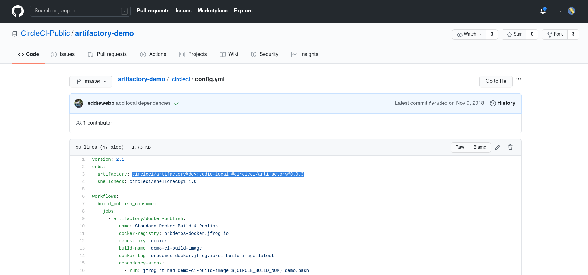

# The Gravitee Circle CI `Orb`

This repo versions the source code of the first Circle CI `Orb`, in the Gravitee.io CI CD system.

The Circle CI pipeline defintion for any git repo is done using a yaml file, in that git repo, of path `.circleci/config.yml`.

This `Orb` is a reusable component, which can be reused to define any Circle CI Pipeline, of any Gravitee.io git repo, in the `.circleci/config.yml` file.

The first release of this `Orb`, will contain the definition of a standard maven release process, for all Gravitee Software Development Process.

## The Release Job

Using the Release Job in a  `.circleci/config.yml` is simple, and can be done as such :

```Yaml
version: 2.1
parameters:
  # 'gio_action' will soon be renamed 'cicd_process'
  gio_action:
    type: enum
    enum: [product_release, lts_support_release, sts_support_release, dev_pr_review, support_pr_review, pull_requests_bot]
    # default parameter value will for now, select no workflow to execute.
    default: pull_requests_bot
  dry_run:
    type: boolean
    # always run in dry run modeby default
    default: true

orbs:
  # secrethub: secrethub/cli@1.0.0
  gravitee: orbinoid2/gravitee@0.0.14
  # gravitee: gravitee-io/gravitee@0.0.1

workflows:
  version: 2.1
  release:
    when:
      equal: [ product_release, << pipeline.parameters.gio_action >> ]
    jobs:
      # Job defined from the CICD Circle CI Orb , using a Machine executor.
      - gravitee/release:
          dry_run: << pipeline.parameters.dry_run >>
          maven_version: 3.6.3
```

The _parameters_ of the release Orb Job, are :

* `dry_run` : a boolean, if set to `true` (actually to `1`) , will activate the dry-run mode. DEfaults to `true`
* `maven_version` : a string, which alows to set the version of the `maven` utility used at (Pipeline) runtime.


## Versioning Policy on Circle Ci `Orb`s (made `Gitops`-compliant)

Circle CI Orb Registry user permissions model has a particularity.

>
> Only Organization Admins can create namespaces, create orb names, and create “production” releases of orbs. All org members can publish “dev” versions of orbs once the orb name itself has been provisioned in the namespace by an Organization Administrator.
>

So,let's sum this up :

* unless a Github.com User has `owner` role over an entire Github organization, he cannot publish semver releases of an `Orb`, like `0.0.1` for example
* A user who is just a `member` of that organization, can neverthe less, publish versions of the form `${ORB_NAMESPACE}/${ORB_NAME}@dev:0.0.1`
* A user who is just a `member` of a Github organization, trying to release a `Circle Ci` `Orb`, will get the following error :

```bash
Error: User does not have access to publish SemVer orbs in this namespace.
```

### Consquences on the versioning policy

Therefore :
* Two parallel, and utterly independent versioning can be performed for any Circle CI `Orb`, in the `Orb` Registry :
  * the `dev:`-prefixed versioned numbers, of the form `dev:x.y.z`
  * the "actual" fully semver compliant releases, witout prefix, and of the semver form `x.y.z`
* The question is :
  * given this possibility of "two parallel versioning worlds", in a Circle CI Orb Registry,
  * how are we going to match `git` versions of the source code of an `Orb`, and this `Orb` Registry's versions ?
* A clear policy must be established.

Before explaining the policy, we must understand why those "two versioning worlds" are there, what can be their for ?

The answer is very simple :

* Between what Circle CI calls "semver" releases, (publishing allowed only for organization "owners"), (between two of those releases), with version number `x.y.z`
* people can use the "parallel world releases" `dev-` prefixed versions, to published as many releases as necessary, to prepare the next "semver"/"actual" release.


I won't explain why, it has to be so, I will just mention that to remain "_gitops_", there must exist an isomorphism of directed acyclclic graphs (DAG) , between every git repo (versioning an Orb source code), and its associated Orb Registry.

The verisoning policy is designed, so that this isomorphism, is obvious.

So here below is the Gravitee Gitops Policy strategy.


### The Policy

Below, `x`,  `y`, `z`, and `w`, are all integers between `0` and `9999`

The match between orbs releases in Orb Registry, and Orb source code git releases, will be the following :
* to prepare any `gravitee-io/gravitee@x.y.z` release in `Orb` Registry, we will release a many `@dev:` -prefixed as neccesary :
  * `@dev:` -prefixed releases to prepare `gravitee-io/gravitee@x.y.z` release in `Orb` Registry, will be version numbered :
    * `gravitee-io/gravitee@dev:x.y.z-0`,
    * `gravitee-io/gravitee@dev:x.y.z-1`,
    * `gravitee-io/gravitee@dev:x.y.z-2`,
    * etc...
    * `gravitee-io/gravitee@dev:x.y.z-9999`
  * Hopefuly, we will be able to successfully prepare any release, with less thant ten thousand intermediary "_dev_" releases.
* And :
  * any `gravitee-io/gravitee@x.y.z` release in `Orb` Registry, will be matched to the `x.y.z` git release, in the git repo versioning the source code of the Circle CI Orb [https://github.com/gravitee-io/gravitee-circleci-orb]
  * any `gravitee-io/gravitee@dev:x.y.z-${ALPHA}` release in `Orb` Registry, will be matched to the `x.y.z` git release, in the git repo versioning the source code of the Circle CI Orb [https://github.com/gravitee-io/gravitee-circleci-orb]

And generalized to any Circle CI `Orb` :

* to prepare any `${ORB_NAMESPACE}/${ORB_NAME}@x.y.z` release in `Orb` Registry, we will release a many `@dev:` -prefixed as neccesary :
  * `@dev:` -prefixed releases to prepare `gravitee-io/gravitee@x.y.z` release in `Orb` Registry, will be version numbered :
    * `${ORB_NAMESPACE}/${ORB_NAME}@dev:x.y.z-0`,
    * `${ORB_NAMESPACE}/${ORB_NAME}@dev:x.y.z-1`,
    * `${ORB_NAMESPACE}/${ORB_NAME}@dev:x.y.z-2`,
    * etc...
    * `${ORB_NAMESPACE}/${ORB_NAME}@dev:x.y.z-9999`
  * Hopefuly, we will be able to successfully prepare any release, with less than ten thousand intermediary "_dev_" releases.
* And :
  * any `{ORB_NAMESPACE}/${ORB_NAME}@x.y.z` release in `Orb` Registry, will be matched to the `x.y.z` git release, in the git repo versioning the source code of the Circle CI Orb [https://github.com/gravitee-io/gravitee-circleci-orb]
  * any `{ORB_NAMESPACE}/${ORB_NAME}@dev:x.y.z-w` release in `Orb` Registry, will be matched to the `dev-x.y.z-w` git release, in the git repo versioning the source code of the Circle CI Orb [https://github.com/gravitee-io/gravitee-circleci-orb]

With this convention, it is always clear, and obvious :
* which version, is "before" any other
* how versions arematched, between git repositories versioning ORbs source code, nd orb Registry versions.

And makes the Gravitee CI CD a `Gitops`-compliant infrastructure, managed as code. ("Infra As Code")

Also so mcuh easier to everyday manage, "without having to think about it, just follow git".

_Note : _

This part has to be worked on again, especially to fully demonstrate how a team collaboration can be managed on a Circle CI `Orb`.

Now, for that future work, here is a very important real life example, of the versioning policy used by the Circle CI Team itself :



### The funny problem with `npm`

I'll explain nowa a funny issue, meaningful, which happened to be raised due to Circle CI `dev:` prefix Orb versioning "parallel world", and how I quickly fixed it.

Orbinoid works that way :
* it picks up the orb version number to publish, from `package.json`
* to publish orb `dev:0.0.1.0`, i therefore set to that version number, the `version` in `package.json`
* and then I had this erro, when I ran `npm start -- -p`, to publish the `gravitee-io/gravitee@dev:0.0.1.0` orb  :
```bash
$ npm run dev
npm ERR! Invalid version: "dev:0.0.1.0"

npm ERR! A complete log of this run can be found in:
npm ERR!     /home/jibl/.npm/_logs/2020-10-20T12_10_09_900Z-debug.log
```

I fixed that issue quickly very simply :
* added another GNU option `-dp` so that :
  * in `package.json` `version: ${VERSION}`
  * `npm start -- -d ` : will publish orb version with `dev:` prefix
  * `npm start -- -p ` : will publish orb version without `dev:` prefix


### And the "_non-immutability_" of the "`dev` versioning world"

Finally, I immediately wanted to test something : are "`dev` world versions", immutable, just like their real world pairs ?

Well it appeared thatthe answer is no !

Andthat makes sense :
* to prepare any orb release, just like I experienced, anyone needs to publish an orb version,
* and to publish that Orb version, many times, with a modification every time (until)
* to publish to orb is necessary, us to be able to test it, inside a "real pipeline", meaning in a `.circleci/.config.yml`

This fact is confirmed by the stdout of the Circle CI CLI :

* which makes sense :it is made for testing, not stable

<pre>
 === Publishing Circle CI Orb [gravitee-io/gravitee@dev:0.0.1-0] to remote Orb registry
Orb `gravitee-io/gravitee@dev:0.0.1-0` was published.
Please note that this is an open orb and is world-readable.
Note that your dev label `dev:0.0.1-0` can be overwritten by anyone in your organization.
Your dev orb will expire in 90 days unless a new version is published on the label `dev:0.0.1-0`.
Successfully Published Circle CI Orb [gravitee-io/gravitee@dev:0.0.1-0] in remote Orb registry
Visit Published Circle CI Orb 's Homepage at https://circleci.com/developer/orbs/orb/gravitee-io/gravitee [dev:0.0.1-0] in Orb registry
</pre>

Note that the published "dev" orb :
* is made available by the Circle CI Orb Registry
* but not visible on the Orb Registry Web UI (not available to others users

Excellent, this makes possible defining a **simplified** Gitops compliant Versioning Policy for Orbs :


## The Simplified, Gitops compliant, Versioning Policy

Below, `x`,  `y`, `z`, and `w`, are all integers between `0` and `9999`

The match between orbs releases in Orb Registry, and Orb source code git releases, will be the following :
* to prepare any `gravitee-io/gravitee@x.y.z` release in `Orb` Registry, we will release a many `@dev:` -prefixed as neccesary :
  * `@dev:` -prefixed releases to prepare `gravitee-io/gravitee@x.y.z` release in `Orb` Registry, will all be version numbered `gravitee-io/gravitee@dev:x.y.z`,
  * and everytime we need to bring a new modification, we just publish the modified Orb with the same `@dev:x.y.z` version number, overwrtting the previously published one.
  * And we always will be able to successfully prepare any release, with as many updated/overwritten "_dev_" releases as neccessary.
* On the `git` side :
  * any `gravitee-io/gravitee@x.y.z` release in `Orb` Registry, will be matched to the `x.y.z` git release, in the git repo versioning the source code of the Circle CI Orb [https://github.com/gravitee-io/gravitee-circleci-orb]
  * any `gravitee-io/gravitee@dev:x.y.z` dev release in `Orb` Registry, will :
    *  never be matched to any `git` release,
    * but be matched to the commit tagged `dev-x.y.z`, on the git branch on wich the devops is working.
    * Everytime he publishes a modified `gravitee-io/gravitee@dev:x.y.z` dev release in `Orb` Registry, the `dev-x.y.z` tag will move forward : the previous `dev-x.y.z` tag will be removed, and created again, on the new `git` commit.

And generalized to any Circle CI `Orb` :

* to prepare any `{ORB_NAMESPACE}/${ORB_NAME}@x.y.z` release in `Orb` Registry, we will release a many `@dev:` -prefixed as neccesary :
  * `@dev:` -prefixed releases to prepare `{ORB_NAMESPACE}/${ORB_NAME}@x.y.z` release in `Orb` Registry, will all be version numbered `{ORB_NAMESPACE}/${ORB_NAME}@dev:x.y.z`,
  * and everytime we need to bring a new modification, we just publish the modified Orb with the same `@dev:x.y.z` version number, overwrtting the previously published one.
  * And we always will be able to successfully prepare any release, with as many updated/overwritten "_`dev`_" releases as neccessary.
* On the `git` side :
  * any `{ORB_NAMESPACE}/${ORB_NAME}@x.y.z` release in `Orb` Registry, will be matched to the `x.y.z` git release, in the git repo versioning the source code of the Circle CI Orb [https://github.com/gravitee-io/gravitee-circleci-orb]
  * any `{ORB_NAMESPACE}/${ORB_NAME}@dev:x.y.z` dev release in `Orb` Registry, will :
    * never be matched to any `git` release,
    * but be matched to the commit tagged `dev-x.y.z`, on the git branch on wich the devops is working.
    * Everytime he publishes a modified `{ORB_NAMESPACE}/${ORB_NAME}@dev:x.y.z` dev release in `Orb` Registry, the `dev-x.y.z` tag will move forward : the previous `dev-x.y.z` tag will be removed, and created again, on the new `git` commit.


With this convention, it is always clear, and obvious :
* which version, is "before" any other
* how versions are matched, between git repositories versioning Orbs source code, and orb Registry versions.

And makes the Gravitee CI CD a `Gitops`-compliant infrastructure, managed as code. ("Infra As Code")

And simplified.

Also so mcuh easier to everyday manage, "without having to think about it, just follow git".


**Meta**: This repository is open for contributions! Feel free to open a pull request with your changes. Due to the nature of this repository, it is not built on CircleCI. The Resources and How to Contribute sections relate to an orb created with this template, rather than the template itself.

## Resources

[CircleCI Orb Registry Page](https://circleci.com/orbs/registry/orb/<namespace>/<project-name>) - The official registry page of this orb for all versions, executors, commands, and jobs described.
[CircleCI Orb Docs](https://circleci.com/docs/2.0/orb-intro/#section=configuration) - Docs for using and creating CircleCI Orbs.

### How to Contribute

We welcome [issues](https://github.com/<organization>/<project-name>/issues) to and [pull requests](https://github.com/<organization>/<project-name>/pulls) against this repository!

### How to Publish
* Create and push a branch with your new features.
* When ready to publish a new production version, create a Pull Request from fore _feature branch_ to `master`.
* The title of the pull request must contain a special semver tag: `[semver:<segement>]` where `<segment>` is replaced by one of the following values.

| Increment | Description|
| ----------| -----------|
| major     | Issue a 1.0.0 incremented release|
| minor     | Issue a x.1.0 incremented release|
| patch     | Issue a x.x.1 incremented release|
| skip      | Do not issue a release|

Example: `[semver:major]`

* Squash and merge. Ensure the semver tag is preserved and entered as a part of the commit message.
* On merge, after manual approval, the orb will automatically be published to the Orb Registry.


For further questions/comments about this or other orbs, visit the Orb Category of [CircleCI Discuss](https://discuss.circleci.com/c/orbs).
